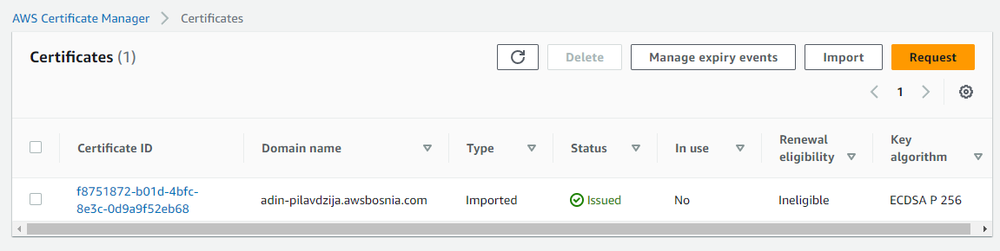

# 08 Implement SSL Let's Encrypt, migrate to AWS ACM

## Task

Za kompletiranje Task-8 potrebno je napraviti sljedece:
IAM User 1 ce svoje resurse da kreira unutar eu-central-1 regiona.

Svaki od AWS resursa koje kreirate pored taga Name mora sadrzavati i tagove CreatedBy: Ime Prezime i Email: vas@email.com

- [ ] Od AMI image ec2-ime-prezime-web-server napravite novu EC2 instancu ec2-ime-prezime-task-8
- [ ] Kreirati DNS record <ime>-<prezime>.awsbosnia.com za Hosted Zone awsbosnia.com (Hosted zone ID: Z3LHP8UIUC8CDK) koji ce da pokazuje na EC2 instancu koju ste krairali. Za kreiranje DNS zapisa korisite AWS CLI AWS kredencijale koji se nalaze unutar sljedeceg excel file-a. AWS CLI konfigurisite tako da koristite named profile aws-bosnia. Kako da podesite AWS CLI i vise o CLI profilima mozete vidjeti ovdje
Za ovaj dio taska mozete da iskorisite change-resource-record-sets AWS CLI komandu. Kada ste dodali novi DNS record njegov Name i Value ispiste uz pomoc komande aws route53 list-hosted-zones i alata jq gdje cete prikazati samo Name i Value za DNS record koji ste vi kreirali odnosno za vase domensko ime.
- [ ] Na EC2 instanci ec2-ime-prezime-task-8 kreirati Let's Encrypt SSL certifikat za vasu domenu. Neophodno je omoguciti da se nodejs aplikaciji moze pristupiti preko linka https://<ime>-<prezime>.awsbosnia.com, to verifikujte skrinsotom gdje se vidi validan certifikat u browseru.
- [ ] Omoguciti autorenewal SSL certifikata
- [ ] Koristeci openssl komande prikazati koji SSL certitikat koristite i datum njegovog isteka. Probajte korisitit razlicite openssl komande (HINT: Biljeskama za office hours imate knjigu u kojoj mozete pronaci recepte za razlicite openssl komande)
- [ ] Importujte Lets Encrypt SSL certifikat unutar AWS Certified Managera.
- [ ] Kreirajte Load Balancer gdje cete na nivou Load Balancera da koristite SSL cert koji ste ranije importovali. (Hint: NGINX config je nophodno auzrirati). Load Balancer u pozadini koristi EC2 instancu ec2-ime-prezime-task-8, nije potrebno kreirati ASG.
- [ ] Koristeci openssl komande prikazati koji SSL certitikat koristite za vasu domenu i datum njegovog isteka.
- [ ] Kreirajte novi SSL certifikat unutar AWS Certified Managera, azurirajte ALB da koristi novi SSL cert koji ste kreirali.
- [ ] Koristeci openssl komande prikazati koji SSL certitikat koristite za vasu domenu i datum njegovog isteka.
- [ ] Kada zavrsite sa taskom kreirajte AMI image pod nazivom ami-ec2-ime-prezime-task-8 i terminirajte resurse koje ste koristili za izradu taska.

Task se smatra kompletiranim kada kreirate PR koji sadrzi koristene komande u tekstualno formatu i skrinsote na kojima se vidi izvrsavanje tih komandi i dobijeni output.

## Task solution

Resursi kreirani unutar `eu-central-1` regiona i sadrze tagove `Name`, `CreatedBy: Adin Pilavdzija` i `Email: adin.pilavdzija@edu.fit.ba`.

### Kreiranje EC2 instance od naseg AMI imagea

Kreirana EC2 instanca `ec2-adin-pilavdzija-task-8` od AMI imagea `ec2-adin-pilavdzija-web-server`.


### Kreiranje DNS recorda 

Kreiran DNS record `adin-pilavdzija.awsbosnia.com` za Hosted Zone `awsbosnia.com` (Hosted zone ID: Z3LHP8UIUC8CDK) koji pokazuje na kreiranu EC2 instancu. 
Za kreiranje DNS zapisa koristen AWS CLI i konfigurisano koristenje named profile `aws-bosnia`.

Za ovaj dio taska koristena je `change-resource-record-sets` AWS CLI komandu. Nakon dodavanja novog DNS record-a, njegovi `Name` i `Value` ispisani su uz pomoc komande `aws route53 list-hosted-zones` i alata `jq`, gdje su prikazani samo `Name` i `Value` za DNS record kreiran za moje domensko ime.

```bash
$ aws route53 change-resource-record-sets --hosted-zone-id Z3LHP8UIUC8CDK --change-batch '{"Changes":[{"Action":"UPSERT","ResourceRecordSet":{"Name":"adin-pilavdzija.awsbosnia.com.","Type":"A","TTL":60,"ResourceRecords":[{"Value":"52.59.103.129"}]}}]}'
#kreiran DNS record za Hosted Zone awsbosnia.com
```


```bash
$ aws route53 list-resource-record-sets --hosted-zone-id Z3LHP8UIUC8CDK | jq '.ResourceRecordSets[] | select(.Name == "adin-pilavdzija.awsbosnia.com.") | {Name, Value}' 
#ispisivanje Name i Value DNS recorda pomocu jq*
```


### Let's Encrypt SSL certifikat

Na EC2 instanci `ec2-adin-pilavdzija-task-8` kreiran je Let's Encrypt SSL certifikat za domenu `adin-pilavdzija.awsbosnia.com`. 

Kreiranje Let's Encrypt certifikata pomocu alata certbot:

```bash
$ sudo dnf install python3 augeas-libs  
$ sudo python3 -m venv /opt/certbot/  
$ sudo /opt/certbot/bin/pip install --upgrade pip  
$ sudo /opt/certbot/bin/pip install certbot certbot-nginx  
$ sudo ln -s /opt/certbot/bin/certbot /usr/bin/certbot  
$ sudo ls -la /usr/bin/certbot  
$ sudo certbot certonly --nginx  
```


Omoguceno je da se nodejs aplikaciji moze pristupiti preko linka `https://adin-pilavdzija.awsbosnia.com`. Skrinsot gdje se vidi validan certifikat u browseru:


### Autorenewal SSL certifikata

Omogucen autorenewal SSL certifikata.

```bash
$ SLEEPTIME=$(awk 'BEGIN{srand(); print int(rand()*(3600+1))}'); echo "0 0,12 * * * root sleep $SLEEPTIME && certbot renew -q" | sudo tee -a /etc/crontab > /dev/null #autorenewal preko certbota
```

### Prikaz SSL certifikata 

Prikaz SSL certitikata i datuma njegovog isteka koristeci openssl komande:

```bash
$ openssl s_client -showcerts -connect adin-pilavdzija.awsbosnia.com:443
```


### Import Let's Encrypt SSL certifikata unutar AWS Certified Managera (ACM)

Pozicioniramo se u folder sa certifikatima koje je generisao Let's Encrypt. U AWS-u, odemo na ACM i importujemo certifikat na način da kopiramo ključeve iz terminala u odgovarajuća polja:
`Certificate body` - `cert.pem`
`Certificate private key` - `privkey.pem`
`Certificate chain` - `fullchain.pem`

Dodani su tagovi `CreatedBy` i `Email` pri kreiranju.

Dokumentacija za importovanje certifikata u AWS Certificate Manager se nalazi na [Importing certificates into AWS Certificate Manager](https://docs.aws.amazon.com/acm/latest/userguide/import-certificate.html).

Na slici vidimo uspješno importovan certifikat:



### Kreiranje Load Balancera 

Kako se radi o Load Balanceru, potrebno je da imamo najmanje 2 instance kreiranje koje dodajemo u target group, kako bismo obezbjedili visoku dostupnost aplikacije, pa kreiramo još jednu EC2 instancu od AMI image-a.

Kreiramo security group za LB - HTTP 80 anywhere i HTTPS 443 anywhere.
Kreiramo target group za LB: Instances, HTTP 80, Advanced: Traffic port & Healthy treshold: 2, Dodati obje EC2 instance u target group.
Kreiramo Application Load Balancer ec2-ime-prezime-task-8 Dodamo kreiranu Security Grupu, u Listener HTTP:80 dodamo kreiranu Target grupu

Kreiran Load Balancer koji koristi SSL cert koji je ranije importovan. NGINX config je azuriran. Load Balancer u pozadini koristi EC2 instancu ec2-adin-pilavdzija-task-8. Dodana kreirana Security Group, a u Listener HTTP:80 dodana kreirana Target group.


### Prikaz SSL certifikata 

Prikaz SSL certifikata koristeci openssl komande:

```bash
$ openssl s_client -showcerts -connect adin-pilavdzija.awsbosnia.com:443 2>/dev/null | openssl x509 -noout -text
```


### Novi SSL cert unutar ACM-a

Kreiran novi SSL certifikat unutar AWS Certified Managera i azuriran ALB da koristi novi SSL cert.

Bilo je potrebno obrisati postojeći record zbog errora (ne moze CREATE Action jer je već kreiran):

```bash
$ aws route53 change-resource-record-sets --hosted-zone-id Z3LHP8UIUC8CDK --change-batch '{"Changes":[{"Action":"DELETE","ResourceRecordSet":{"Name":"adin-pilavdzija.awsbosnia.com.","Type":"A","TTL":60,"ResourceRecords":[{"Value":"52.59.103.129"}]}}]}'
```

Dodavanje kredencijala novog Amazon certifikata unutar AWS CLI:

```bash
$ aws route53 change-resource-record-sets --hosted-zone-id Z3LHP8UIUC8CDK --change-batch '{"Changes":[{"Action":"CREATE","ResourceRecordSet":{"Name":"_0745668a2195a19ca010392e8fb6cd97.adin-pilavdzija.awsbosnia.com.","Type":"CNAME","TTL":60,"ResourceRecords":[{"Value":"_f3551e198d743dc791c1934d64fa3289.fcgjwsnkyp.acm-validations.aws."}]}}]}'
```

Bolji nacin kreiranja recorda sa domenom i DNS recordom ALB je da se koristi JSON file:

```bash
$ aws route53 change-resource-record-sets --hosted-zone-id Z3LHP8UIUC8CDK --change-batch file:///home/ec2-user/json-file.json
```


### Prikaz SSL certifikata 

Prikaz SSL certifikata koristeci openssl komande:
```bash
$ echo | openssl s_client -showcerts -servername adin-pilavdzija.awsbosnia.com -connect adin-pilavdzija.awsbosnia.com:443 2>/dev/null | openssl x509 -inform pem -noout -text
```


### Cleanup

Po zavrsetku taska, kreiran AMI image pod nazivom ami-ec2-adin-pilavdzija-task-8 i terminirani koristeni resursi.


