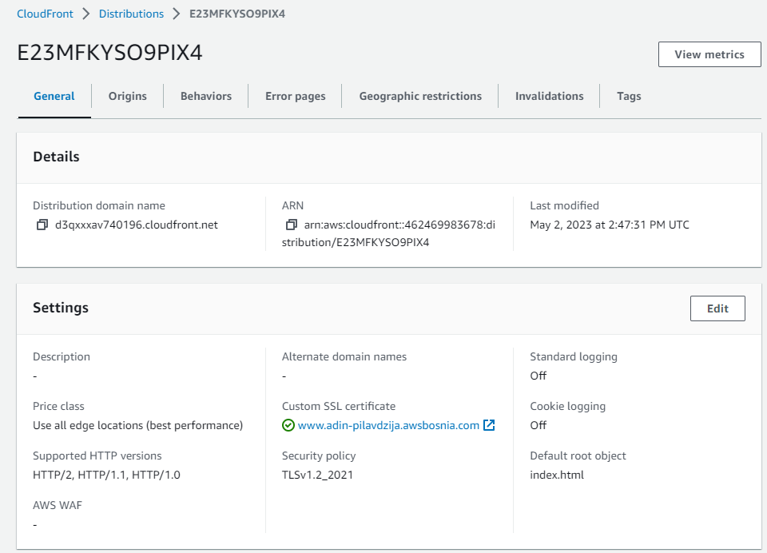

# 09 Static website with S3 and CloudFront

## Task

U tasku 9 je zadatak napraviti `.html` file koji ce prikazivati Vaše ime i prezime, kratki Vaš opis, te DevOps image koji koristimo od početka programa. HTML file uredite kako god želite (text, colors, fonts, etc.), nije bitno, ali da je preglednost u najmanju ruku okey.

Potrebno je kreirati S3 bucket u formatu: `ime-prezime-devops-mentorship-program-week-11`, te omogućiti **static website**:

*   Dodati .html i error.html file,
*   Podesiti bucket na public access, te dodati bucket policy koji će omogućiti samo **minimalne** access permissions nad bucketom.

Drugi dio zadatka jeste objaviti tu statičku web stranicu kroz CloudFront distribuciju.

Prilikom kreiranja CloudFront distribucije potrebno je samo sljedeće opcije modifikovati:

*   Origin domain,
*   Name,
*   Viewer protocol policy (Redirect HTTP to HTTPS),
*   Custom SSL certificate,

SSL certifikat koristite od AWS Certificate Manager-a.

Sve ostale opcije po default ostaviti. Kada se završi kreacija distribucije napraviti record unutar Route 53 ( `www.ime-prezime.awsbosnia.com`) koji će pokazivati na tu distribuciju.

Konfiguraciju Route 53 odraditi na sličan način kroz CLI kao u prethodnom zadatku ([TASK-8](https://github.com/orgs/allops-solutions/projects/1/views/1?pane=issue&itemId=25912238)) gdje će Vaš record pokazivati na distrubuciju.

Ovo su primjeri navedenih endpointa koje je potrebno dostaviti:

*   S3 website endpoint primjer: [S3 static web](http://boris-bradic-devops-mentorship-program.s3-website-eu-west-1.amazonaws.com)
*   Primjer distribution endpointa: [d1ax7sali2r51c.cloudfront.net](https://d1ax7sali2r51c.cloudfront.net)
*   Primjer R53 recorda: [www.boris-bradic.awsbosnia.com](http://www.boris-bradic.awsbosnia.com)

Da biste kompletirali ovaj task potrebno je dostaviti sljedeće kroz PR:

U komentar postaviti:

*   S3 website endpoint - non-encrypted
*   vaš-distribution.net endpoint - encrypted
*   R53 record - encrypted

Bucket može ostati na private, ali je potrebno u tome slučaju prilagoditi bucket policy.

Kreirati novi direktorijum za navedeni task i u njega smjestiti:

*   S3 bucket policy screenshot ( voditi računa da su **minimalne** permisije postavljene),
*   .html i error.html file, DevOps image,
*   Screenshot - S3 website endpointa,
*   Screenshot - distribution endpointa,
*   Screenshot - R53 recorda koji je uspješno izvršio load distribucije,
*   Screenshot konfigurisanoga R53 recorda prema distribuciji.

Koristite AWS dokumentaciju ukoliko naiđete na bilo kakve probleme konfigurisanja CloudFronta sa R53.

## Task Solution

Kreirani [index.html](./index.html) i [error.html](./error.html) fajlovi.
Kreirati S3 bucket: `adin-pilavdzija-devops-mentorship-program-week-11`. Dodani index.html i error.html fajlovi u bucket.


Omogućen **static website**


Podesen bucket na public access, te dodan bucket policy koji omogućava samo **minimalne** access permissions nad bucketom.


Prikaz website-a:


Prilikom kreiranja CloudFront distribucije pdoesimo sljedeće opcije:
- Origin domain - izaberemo S3 bucket
- Name ostavimo defaultno
- Origin access - public
- Default root object - index.html
- Viewer protocol policy - (Redirect HTTP to HTTPS)
- Settings - Custom SSL certificate - izaberemo kreirani Amazon certifikat



Statička web stranica objavljena kroz CloudFront distribuciju. Prikaz preko browsera koristeci `Distribution domain name`:


ACM certifikat je potrebno aktivirati koristeci AWS CLI:

```bash
$ aws route53 change-resource-record-sets --hosted-zone-id Z3LHP8UIUC8CDK --change-batch '{"Changes":[{"Action":"UPSERT","ResourceRecordSet":{"Name":"www.adin-pilavdzija.awsbosnia.com","Type":"CNAME","TTL":60,"ResourceRecords":[{"Value":"d3qxxxav740196.cloudfront.net"}]}}]}'
```


Prikaz domene u browseru:


---

- [S3 website endpoint](http://adin-pilavdzija-devops-mentorship-program-week-11.s3-website.eu-central-1.amazonaws.com)
- [distribution.net endpoint](https://d3qxxxav740196.cloudfront.net)
- [R53 record](https://www.adin-pilavdzija.awsbosnia.com/)